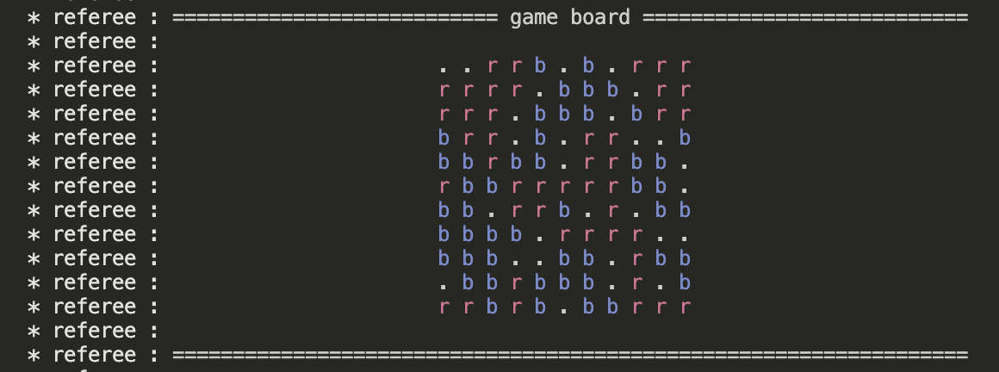

# Tetress AI

A* search and a heuristic game-playing agent for Tetress — an 11×11 wrapping board game where players alternate placing tetromino pieces and full rows/columns are cleared after each move.

Built for COMP30024 Artificial Intelligence, University of Melbourne, Semester 1 2024.

---

## The Problem

Tetress is a two-player combinatorial game on an 11×11 toroidal board (edges wrap). On each turn a player places a tetromino (any of the standard 7 Tetris shapes in any rotation) adjacent to one of their existing pieces. Any row or column that becomes fully occupied is immediately cleared — for both players simultaneously. A player loses when they have no legal moves.

This makes the game strategically interesting for two reasons:
1. **Branching factor**: the number of legal placements per turn can be very large, making deep search expensive.
2. **Line-clearing side effects**: placing a piece can clear rows/columns and change the board in ways that affect both players' future mobility — sometimes beneficially, sometimes not.

**Part A** is a single-player puzzle: given a board state and a target cell, find the minimum sequence of tetromino placements (any colour) that fills the row or column containing the target.

**Part B** is a two-player competitive agent: play Tetress against opponents, maximising the chance of winning.

---

## Approach

### Part A — A* Search

Standard A* on board states. The heuristic is admissible:

```
h(state) = min(
    ceil(row_distance / 4) + ceil(empty_cells_in_row / 4),
    ceil(col_distance / 4) + ceil(empty_cells_in_col / 4)
)
```

`row_distance` and `col_distance` are the number of pieces still needed to reach the target row/column from the current frontier, computed with modular arithmetic to account for board wrapping. Dividing by 4 gives a lower bound since each tetromino covers exactly 4 cells.

### Part B — Heuristic Game Agent

The final agent (`agent/`) uses **greedy 1-ply lookahead** with a two-phase evaluation function and a hardcoded opening book.

**Move generation** uses precomputed tetromino placements indexed by board coordinate and expansion direction, with directional pruning: moves are only generated for directions adjacent to an empty cell, cutting the search space substantially.

**Heuristic** scores a board state as `my_score − w × opponent_score` where:
- `score = Σ min(6, pieces_in_row) + Σ min(6, pieces_in_col) + spread_bonus`
- Capping at 6 rewards building toward full lines without over-crediting nearly-complete ones
- The spread bonus rewards occupying many distinct rows and columns
- Early game: `w = 1.25`; late game (turn ≥ 45): `w = 1.5` — increasing aggression as the board fills

**Late-game addition**: if the agent's mobility (number of distinct expansion directions with at least one legal move) exceeds 25, a bonus of +20 is added to the score, rewarding flexibility when the board becomes congested.

**Opening book**: on the first two turns, the agent plays one of six fixed corner/center squares, placing a 2×2 block to establish early board presence.

The `agent_minimax/` directory contains an alternative implementation using minimax with alpha-beta pruning at depth 1 for comparison.

---

## How to Run

Requires Python 3.11+. No third-party packages — stdlib only.

### Part A

```bash
cd part_a
python -m search < test-vis1.csv
```

Input is a CSV where `r`/`R` = red cells, `b`/`B` = blue cells, uppercase `B` marks the target coordinate. Three sample inputs are included (`test-vis1.csv`, `test-vis2.csv`, `test-vis3.csv`).

### Part B

```bash
cd part_b

# Final agent (RED) vs random baseline (BLUE)
python -m referee agent agent_random

# Random (RED) vs final agent (BLUE)
python -m referee agent_random agent

# Agent vs minimax variant
python -m referee agent agent_minimax

# Silent output (result only)
python -m referee agent agent_random -v 0

# With time limit (seconds per player)
python -m referee agent agent_random -t 180

# Log to file
python -m referee agent agent_random -l game.log
```

Verbosity: `-v 0` result only, `-v 1` commentary, `-v 2` (default) commentary + board render, `-v 3` debug.



---

## Project Structure

```
part_a/
├── search/
│   ├── program.py       # A* implementation
│   ├── core.py          # Types: Coord, PlaceAction, PriorityQueue (course-provided)
│   ├── templates.py     # Tetromino shape definitions
│   ├── utils.py         # Board renderer (course-provided)
│   └── __main__.py      # Entry point / CSV parser (course-provided)
└── test-vis{1,2,3}.csv  # Sample inputs

part_b/
├── agent/               # Final submission agent
│   ├── program.py       # Two-phase greedy agent
│   └── templates.py     # Precomputed move table
├── agent_minimax/       # Minimax + alpha-beta variant (depth 1)
├── agent_greedy/        # Earlier greedy iteration
├── agent_random/        # Uniform random baseline
├── referee/             # Game engine — course-provided, not my code
├── test.sh              # Batch benchmark script (100 games each side)
├── testing/             # Benchmark results
└── report.pdf           # Written analysis submitted with the project
```

---

## Future Work

- **Deeper search**: the current agent is strictly 1-ply. Even depth 2 with alpha-beta would likely increase win rate significantly, though the branching factor makes it expensive. Move ordering (try moves that clear lines first) would help.
- **MCTS**: Monte Carlo Tree Search would handle the large branching factor more gracefully than minimax and could be tuned to any time budget.
- **Better endgame handling**: the late-game heuristic uses a fixed turn threshold (45) rather than detecting actual board congestion. A density-based trigger would be more robust.
- **`undo_apply_move` cleanup**: currently sets `board[coord] = None` instead of deleting the key, which grows the board dict with `None`-valued entries. Harmless given the current codebase's use of `.get() is None`, but worth fixing for correctness.
- **Proper test harness**: `test.sh` is a simple loop with no statistics. A proper harness would report confidence intervals and test against more opponents.
