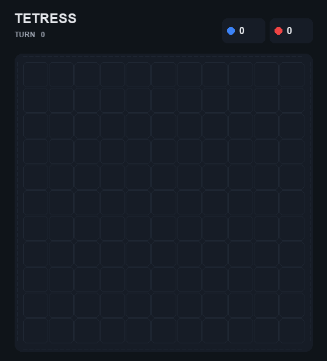
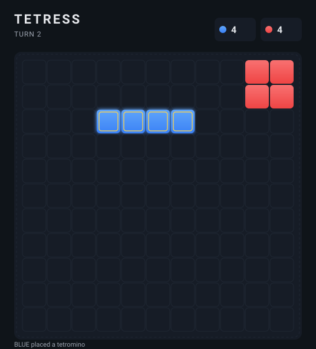
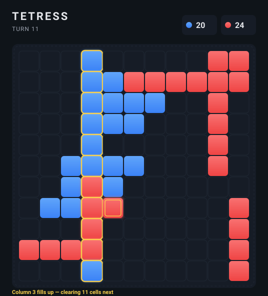
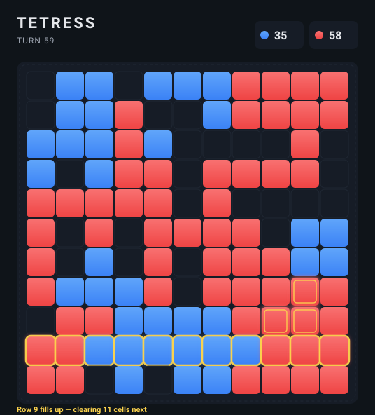

# Tetress AI

A* search, a minimax+alpha-beta agent, and a tuned heuristic agent for Tetress — an 11×11 wrapping board game where players alternate placing tetromino pieces and full rows/columns are cleared after each move.

Coursework project for COMP30024 Artificial Intelligence, University of Melbourne, Semester 1 2024.

<p align="center">
  
</p>

<p align="center">
  <em>Final agent (RED) vs. random baseline (BLUE). Recorded with <a href="viz/record_game.py"><code>viz/record_game.py</code></a>.</em>
</p>

<table align="center">
  <tr>
    <td align="center"><br/><sub><b>Opening</b> · the 2×2 books on both sides</sub></td>
    <td align="center"><br/><sub><b>Line clear</b> · column 3 fills up, about to wipe 11 cells</sub></td>
    <td align="center"><br/><sub><b>Late game</b> · 89 cells occupied</sub></td>
  </tr>
</table>

> **Want to scrub through a game yourself?** Open [`viz/viewer.html`](viz/viewer.html) in a browser (served from the `viz/` directory — eg. `cd viz && python3 -m http.server`) to step through frame-by-frame with play / pause / arrow-key controls.

---

## The Problem

Tetress is a two-player combinatorial game on an 11×11 toroidal board (edges wrap). On each turn a player places a tetromino (any of the standard 7 Tetris shapes in any rotation) adjacent to one of their existing pieces. Any row or column that becomes fully occupied is immediately cleared — for both players simultaneously. A player loses when they have no legal moves.

This makes the game strategically interesting for two reasons:
1. **Branching factor**: the number of legal placements per turn can be very large, making deep search expensive.
2. **Line-clearing side effects**: placing a piece can clear rows/columns and change the board in ways that affect both players' future mobility — sometimes beneficially, sometimes not.

**Part A** is a single-player puzzle: given a board state and a target cell, find the minimum sequence of tetromino placements (any colour) that fills the row or column containing the target.

**Part B** is a two-player competitive agent: play Tetress against opponents, maximising the chance of winning.

---

## Approach

### Part A — A* Search

Standard A* over board states. Each state is a `dict[Coord, PlayerColor]`; states are converted to a tuple-of-tuples to use as a hashable key in `g_score` and `came_from`. Neighbour expansion places a tetromino adjacent to any existing RED piece and applies line clears — except that any full row or column containing the target is **preserved**, since clearing it would erase the goal. Neighbour generation prunes the four expansion directions whose adjacent cell is occupied, since no tetromino can be placed there.

The heuristic is:

```
h(state) = min(
    ceil(row_distance / 4) + ceil(empty_in_target_row / 4),
    ceil(col_distance / 4) + ceil(empty_in_target_col / 4)
)
```

`row_distance` is the minimum modular (wrap-around) distance, in cells, from any RED piece to the target row; `col_distance` is the same for the target column. Both terms are divided by 4 because a single tetromino spans 4 cells: at best, one placement can extend the frontier by 4 cells toward the target line, or contribute 4 cells to filling it. The `min` of the two estimates keeps the value optimistic when either goal line is closer.

### Part B — Game-Playing Agent

Two agents live in this repo: a **minimax variant with alpha-beta pruning** (`agent_minimax/`) and a **greedy variant with a tuned heuristic** (`agent/`). They share the same board representation, precomputed move tables, and in-place apply/undo machinery — only the search and evaluation differ. The trade-off between them is the central design question of the project: in a game with as wide a per-turn branching factor as Tetress, the cost of going one ply deeper has to be paid for by the marginal value the lookahead actually buys.

#### Shared infrastructure

- **Board representation.** `dict[Coord, PlayerColor]` — only occupied cells appear as keys, so emptiness checks are an O(1) `board.get(coord) is None`.
- **Move generation.** At startup, every possible `PlaceAction` for each board coordinate is enumerated and bucketed by the four expansion directions. At decision time the agent walks its own pieces, skips directions whose adjacent cell is occupied (no piece can root there), and checks each remaining candidate against the live board. This precompute-plus-directional-prune is the main reason both agents are fast enough to scan every legal move every turn.
- **Apply / undo.** Moves are applied to and removed from the board in place — including the cells erased by line clears, which are stashed in a `cleared_info` dict so the undo step can replay them. No board copying happens in the inner search loop.

#### Minimax with alpha-beta pruning (`agent_minimax/`)

`minimax(board, depth, alpha, beta, maximising)` is a standard recursive minimax with alpha-beta pruning. It takes the current board, remaining search depth, the running `alpha` / `beta` bounds, and a `maximising` flag for whose turn it is. The depth parameter is fully configurable — the recursion is general — so the search can be deepened up to whatever the per-turn time budget allows.

- **Terminal cases.** When `depth == 0`, or when the current player has no legal moves (a losing terminal in Tetress), the function returns the static evaluation of the board and `None` as the move.
- **Maximising branch (agent's turn).** For each legal move: apply, simulate the resulting line clears, recurse with `depth − 1` and `maximising=False`, then undo. Track the move with the largest child score, update `alpha = max(alpha, eval)`, and break out of the loop if `beta ≤ alpha`.
- **Minimising branch (opponent's turn).** Symmetric — tracks the smallest child score and updates `beta = min(beta, eval)` instead.

The evaluation function `compute_score` returns `my_score − opponent_score`, where each side scores:

- `Σ min(5, pieces_in_row) + Σ min(5, pieces_in_col)` — capped line-fill credit so the heuristic doesn't keep adding signal past the point where a row is still useful
- A central-control bonus of `+0.5` per piece in the central 3×3 (rows 4–6, columns 4–6) — rewards anchoring near the middle of the board
- A spread bonus of `0.4 × (unique_rows + unique_cols)` — rewards occupying many distinct lines

The opening book is a hardcoded 2×2 block on turn 1 followed by an adjacent horizontal I-piece on turn 2, after which minimax takes over.

#### Final submission: greedy with a tuned heuristic (`agent/`)

The minimax variant was the original approach, and the implementation is fully general — but Tetress's branching factor makes deeper search expensive even with alpha-beta pruning. Within the per-turn time budget on my hardware, the depths I could afford to search were limited; at those depths, the simpler greedy variant with a more refined evaluation function matched or exceeded minimax in head-to-head testing. The greedy agent therefore became the final submission, while the minimax implementation stayed in the repo as the alternative.

The greedy agent does 1-ply lookahead — for each legal move, apply it, simulate line clears, evaluate, and pick the move with the highest score — and switches between an "early game" and "late game" evaluation function by turn count. Both phases score each side as:

```
side_score = Σ min(6, pieces_in_row) + Σ min(6, pieces_in_col)
```

The cap of 6 stops the heuristic from over-rewarding rows that are nearly full but not full enough to clear — only a fully filled line actually pays off, so credit beyond 6 pieces is wasted signal. On top of this the agent adds a **spread bonus** of `k × (unique_rows + unique_cols)` to **its own score only** (the opponent never receives the bonus) — an intentional asymmetry that pushes the agent to play actively across distinct rows and columns rather than clump.

Phase-dependent constants:

| | Early (`turn < 45`) | Late (`turn ≥ 45`) |
|---|---|---|
| Opponent weight `w` in `my_score − w × opp_score` | 1.25 | 1.5 |
| Spread bonus coefficient `k` | 0.4 | 0.5 |
| Mobility bonus | — | `+20` if mobility `> 25` |

**Mobility** is the count of `(friendly piece, direction)` pairs that have at least one legal placement — effectively, the number of distinct expansion slots still open across all the agent's pieces. The late-game `+20` rewards keeping flexibility when the board fills up, where being boxed in is the most common way to lose.

**Opening book.** The agent's first move (whether it plays Red or Blue) returns the first legal placement from a fixed list of six 2×2 blocks — the four corners, an off-corner near the top right, and the centre. The `turn_counter == 1 or 2` check exists because if the agent plays Blue, the opponent's move has already incremented the counter to 2 before the agent first acts; the book only ever fires once per game.

---

## How to Run

Requires Python 3.11+. The agents and referee are **pure stdlib**. The visualizer in [`viz/`](viz/) optionally uses Pillow to produce the animated GIF — the SVG output and the interactive `viewer.html` need no extra packages.

There are three ways to interact with the project:

| | What you see | When to use it |
|---|---|---|
| **Browser viewer** | The dark-themed UI from the screenshots above, with play / pause / scrub / arrow-key controls | You just want to *watch* a game |
| **Terminal referee** | Live ASCII board rendered to your terminal as two agents play | You want to run agents head-to-head, change parameters, time-limit them, log results |
| **Part A solver** | Stdout sequence of placements solving an A* puzzle | You're exercising the Part A search |

### Watch a recorded game in the browser

A pre-recorded game (final agent vs random baseline) ships with the repo. Serve the `viz/` directory locally and open the viewer:

```bash
cd viz
python3 -m http.server          # then open http://localhost:8000/viewer.html
```

(A local server is needed because `viewer.html` `fetch`es `game.json` — opening the file directly with `file://` will be blocked by the browser.)

### Run a live game in the terminal (Part B)

```bash
cd part_b

# Final agent (RED) vs random baseline (BLUE)
python -m referee agent agent_random

# Random (RED) vs final agent (BLUE)
python -m referee agent_random agent

# Agent vs minimax variant
python -m referee agent agent_minimax

# Silent output (result only)
python -m referee agent agent_random -v 0

# With time limit (seconds per player)
python -m referee agent agent_random -t 180

# Log to file
python -m referee agent agent_random -l game.log
```

Verbosity: `-v 0` result only, `-v 1` commentary, `-v 2` (default) commentary + ASCII board render, `-v 3` debug.

### Part A — A* puzzle solver

```bash
cd part_a
python -m search < test-vis1.csv
```

Input is a CSV where `r`/`R` = red cells, `b`/`B` = blue cells, uppercase `B` marks the target coordinate. Three sample inputs are included (`test-vis1.csv`, `test-vis2.csv`, `test-vis3.csv`).

### Regenerating the visuals

The README hero GIF, the three snapshots, and the `game.json` consumed by the browser viewer are all produced by the same script. To rebuild them from a fresh playthrough:

```bash
pip install Pillow                # only needed for the GIF; SVGs and viewer are pure stdlib
python3 viz/record_game.py        # writes assets/playthrough.gif + assets/snapshot_*.svg + viz/game.json
```

The recorder plays the final agent (RED) against `agent_random` (BLUE) with a fixed seed, captures every board state including a "pre-clear" frame whenever a row/column fills up, then emits the GIF, three static SVG snapshots, and the JSON dump.

---

## Results

`part_b/test.sh` runs the final agent against `agent_random` 100 times as RED and 100 times as BLUE. Raw per-game outcomes from the development runs are appended to [`part_b/testing/agent_test.txt`](part_b/testing/agent_test.txt) — the final agent wins the large majority of games against the random baseline. Re-run `bash test.sh` to reproduce.

---

## Project Structure

```
part_a/
├── search/
│   ├── program.py       # A* implementation
│   ├── core.py          # Types: Coord, PlaceAction, PriorityQueue
│   ├── templates.py     # Tetromino shape definitions
│   ├── utils.py         # Board renderer
│   └── __main__.py      # Entry point / CSV parser
└── test-vis{1,2,3}.csv  # Sample inputs

part_b/
├── agent_minimax/       # Minimax with alpha-beta pruning
├── agent/               # Final submission — greedy with tuned heuristic
│   ├── program.py       # Two-phase greedy agent
│   └── templates.py     # Precomputed move table
├── agent_greedy/        # Earlier greedy iteration
├── agent_random/        # Uniform random baseline
├── referee/             # Game engine
├── test.sh              # Batch benchmark script (100 games each side)
├── testing/             # Benchmark results
└── report.pdf           # Written analysis submitted with the project

viz/
├── render.py            # Board → SVG / Pillow Image renderer
├── record_game.py       # Plays a game, records frames, writes GIF + SVGs + JSON
├── viewer.html          # Interactive browser viewer (loads game.json)
└── game.json            # Recorded game data for the viewer (regenerable)

assets/
├── playthrough.gif      # README hero — full game animation
└── snapshot_*.svg       # README still frames at key moments
```

---

## What I'd Change

A few things I'd revisit if I came back to this:

- **Make deeper minimax tractable.** The branching factor is the main obstacle to running the minimax variant deeper within a sensible per-turn time budget. Move ordering that tries line-clearing moves first, transposition tables to memoise repeated states, and tighter pruning in `generate_legal_moves` would all chip away at the cost.
- **MCTS.** Monte Carlo Tree Search would handle the wide branching factor more gracefully than minimax and tunes naturally to any time budget.
- **Density-based phase split.** The early/late switch is hardcoded at turn 45. Triggering on actual board occupancy would be more robust to games that fill up faster or slower than typical.
- **Better benchmark harness.** `test.sh` is a loop with no aggregation — it appends every game to a single file. A proper harness would report win rate with confidence intervals and run against more opponents.
